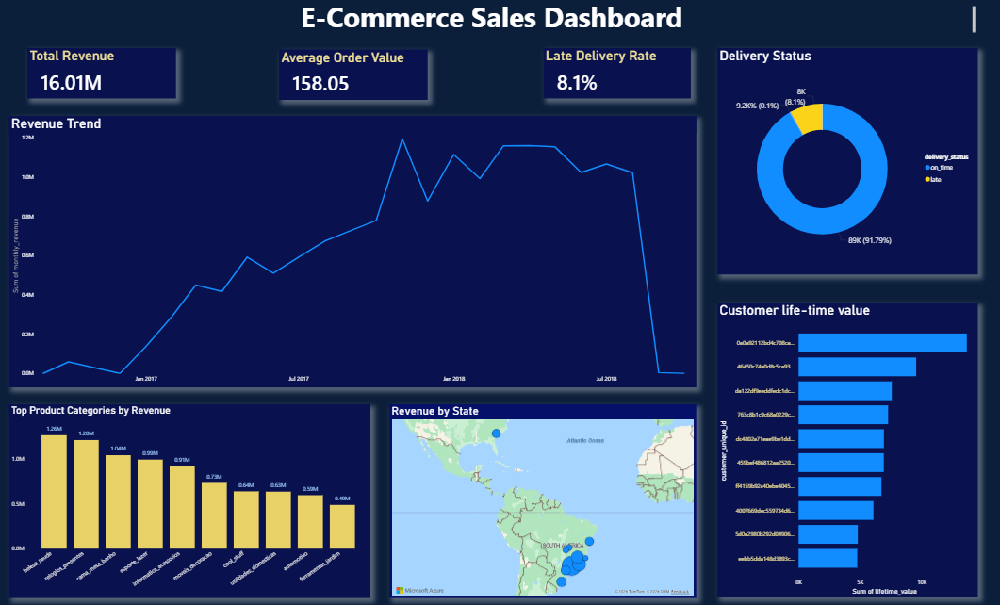

## E-Commerce Sales Analysis
End-to-end data analysis project using **SQL** and **Power BI**.

## Dataset
This project uses the **Brazilian E-Commerce Public Dataset by Olist**, which contains real-world data on orders, customers, payments, and deliveries from an online marketplace.

## Project Overview
This project analyzes e-commerce sales data to uncover key business insights such as:
- Revenue trends over time
- Top-performing product categories
- Customer lifetime value
- Delivery performance (on-time vs late)
- Regional sales distribution
  
## Dashboard Preview


## Tools & Technologies
- SQL (data extraction & transformation)
- Power BI (data visualization)
- Excel (data preparation)
  
## Key Business Insights
- Revenue shows an overall upward trend, indicating consistent business growth over time.
- A small number of product categories contribute disproportionately to total revenue, suggesting opportunities for focused marketing and inventory optimization.
- Customer lifetime value is highly skewed, with a small segment of customers generating the majority of revenue.
- Approximately 8% of deliveries are late, which may negatively impact customer satisfaction and retention.
- Sales are concentrated in specific regions, highlighting key geographic markets for expansion or targeted campaigns.

## Project Structure
```
ecommerce-sales-analysis/
│
├── dashboard/
│   ├── dashboard_preview.png
│   └── ecommerce_dashboard.pbix
│
├── sql/
│   └── queries.sql
│
└── README.md
```
## How to Understand
1. Open the `.pbix` file in Power BI Desktop
2. Explore interactive dashboard
3. Review SQL queries for data analysis logic
